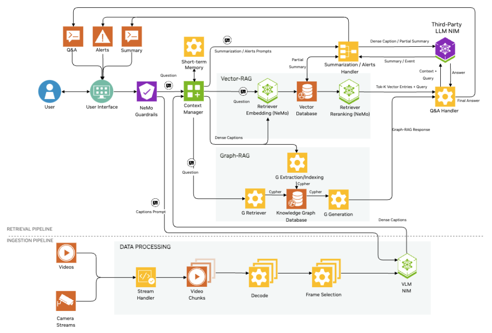

# Section Two

## Subsection A

TODO: Insert Content Here



TODO: Insert Content Here

<details>
<summary><b>Accordion Item i</b></summary>

```
TODO
```

</details>

<details>
<summary><b>Accordion Item ii</b></summary>

```
TODO
```

</details>

<details>
<summary><b>Accordion Item iii</b></summary>

```
TODO
```

</details>

<details>
<summary><b>Accordion Item iv</b></summary>

```
TODO
```

</details>

## Subsection B

TODO: Insert Content Here

## Subsection C

TODO: Insert Content Here

Open <a style="cursor: pointer;" onclick="openOrCreateFileInJupyterLab('labs/sample_notebook.ipynb');"><i class="fas fa-flask"></i> labs/sample_notebook.ipynb</a> to get started.

## Subsection D


TODO: Insert Content Here
